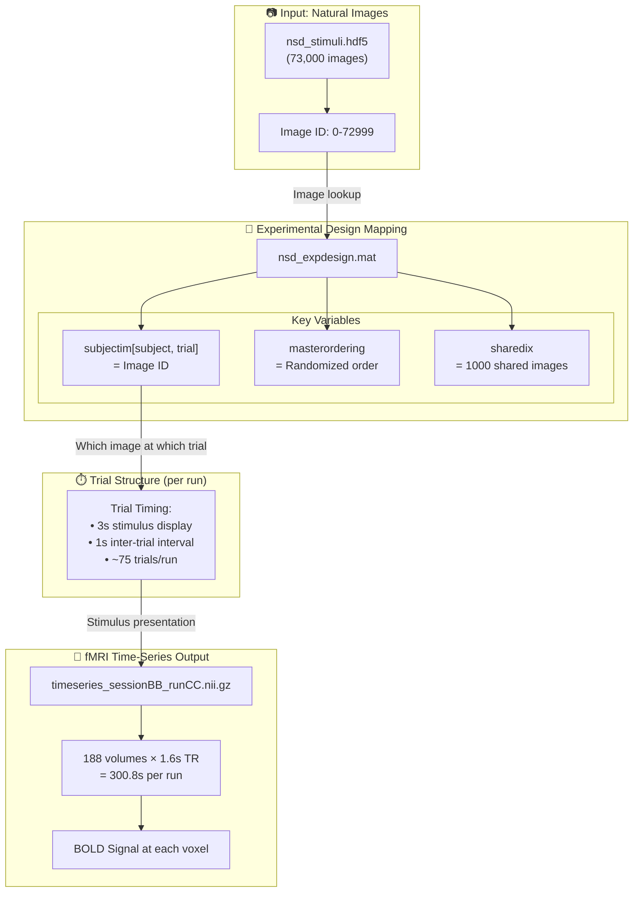
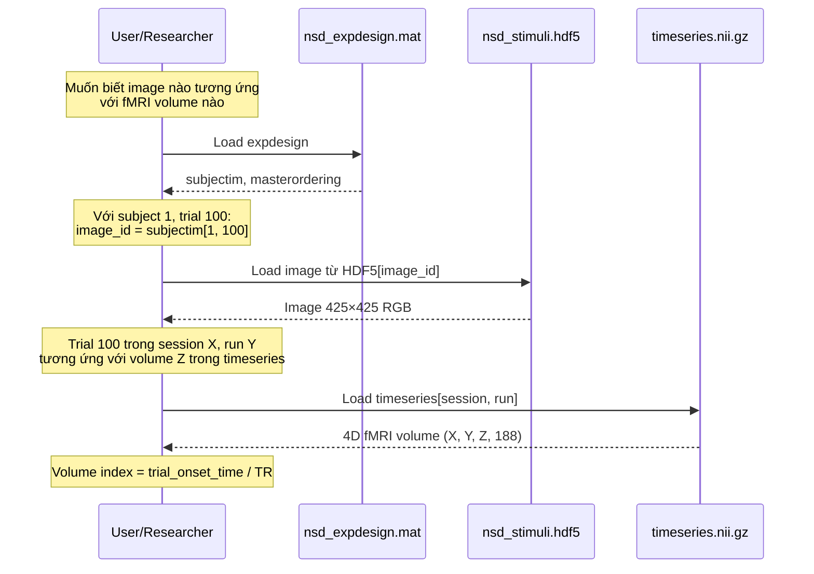

# Ý Nghĩa Cấu Trúc Thư Mục NSD và Cách Ánh Xạ Image-fMRI

## Tổng Quan Cấu Trúc Thư Mục

```
data/NSD/
├── data/
│   ├── nsddata/                    # Dữ liệu chính (~49GB)
│   │   ├── experiments/nsd/
│   │   │   └── nsd_expdesign.mat   # **FILE THEN CHỐT** - chứa mapping image ↔ trial
│   │   └── ppdata/
│   │       └── subj01-08/          # 8 subjects
│   │
│   ├── nsddata_stimuli/            # Hình ảnh kích thích (~40GB)
│   │   └── stimuli/nsd/
│   │       └── nsd_stimuli.hdf5    # 73,000 natural scene images
│   │
│   └── nsddata_timeseries/         # fMRI time-series (~3.4TB)
│       └── ppdata/
│           └── subjXX/func1pt8mm/timeseries/
│               └── timeseries_sessionXX_runXX.nii.gz
├── nsd_docs/                       # Tài liệu mô tả
└── download_data.sh
```

---

## Ý Nghĩa Chi Tiết Từng Thư Mục/File

### 1. [nsddata/experiments/nsd/nsd_expdesign.mat](file:///media/hung/data1/codes/imge2fmri/data/NSD/data/nsddata/experiments/nsd/nsd_expdesign.mat)
| Variable | Ý nghĩa |
|----------|---------|
| `subjectim` | Ma trận 8×10000: Image ID cho mỗi subject tại mỗi trial |
| `masterordering` | Thứ tự random của 30,000 images trong experiment design |
| `sharedix` | Index của 1,000 images được xem chung bởi tất cả subjects |
| `stim_file` | Tên file hình ảnh trong HDF5 |

### 2. `nsddata_stimuli/stimuli/nsd/nsd_stimuli.hdf5`
- Chứa **73,000 natural scene images** từ COCO dataset
- Mỗi image có kích thước **425×425 pixels** (RGB)
- Index từ 0-72999

### 3. `nsddata_timeseries/ppdata/subjXX/func1pt8mm/timeseries/`
| File Pattern | Mô tả |
|--------------|-------|
| `timeseries_session{BB}_run{CC}.nii.gz` | fMRI 4D volume cho session BB, run CC |
| BB = 01-40 | Session number (mỗi subject có 30-40 sessions) |
| CC = 01-14 | Run number trong mỗi session (12-14 runs/session) |

**Thông số kỹ thuật:**
- **TR (Repetition Time)**: 1.6 seconds
- **Volumes per run**: 188 volumes
- **Duration per run**: 188 × 1.6 = 300.8 seconds
- **Resolution**: 1.8mm hoặc 1mm (func1pt8mm / func1mm)

---

## Sơ Đồ Ánh Xạ Image → fMRI



---

## Chi Tiết Quy Trình Ánh Xạ



---

## Công Thức Ánh Xạ Chính

### Từ Image → fMRI Volume

```python
# 1. Load experimental design
import scipy.io as sio
expdesign = sio.loadmat('nsd_expdesign.mat')

# 2. Xác định image ID cho subject và trial cụ thể
subject_idx = 0  # Subject 1 (0-indexed)
trial_idx = 99   # Trial 100 (0-indexed)
image_id = expdesign['subjectim'][subject_idx, trial_idx]

# 3. Load hình ảnh từ HDF5
import h5py
with h5py.File('nsd_stimuli.hdf5', 'r') as f:
    image = f['imgBrick'][image_id]  # Shape: (425, 425, 3)

# 4. Xác định session, run, và volume index
# Trial timing: ~4 seconds per trial (3s stim + 1s ITI)
# TR = 1.6 seconds
# Volumes per run = 188

trials_per_run = 75  # ~75 trials mỗi run
runs_per_session = 12  # 12 runs mỗi session (NSD core)

session = trial_idx // (trials_per_run * runs_per_session) + 1
run_in_session = (trial_idx % (trials_per_run * runs_per_session)) // trials_per_run + 1
trial_in_run = trial_idx % trials_per_run

# Thời điểm onset của trial trong run
trial_onset_time = trial_in_run * 4  # seconds
volume_index = int(trial_onset_time / 1.6)  # TR = 1.6s

# 5. Load fMRI volume tương ứng
import nibabel as nib
timeseries = nib.load(f'timeseries_session{session:02d}_run{run_in_session:02d}.nii.gz')
fmri_volume = timeseries.get_fdata()[:, :, :, volume_index]
```

---

## Lưu Ý Quan Trọng

> [!IMPORTANT]
> **Temporal Relationship**: fMRI BOLD response có độ trễ ~4-6 giây so với stimulus onset do hemodynamic response function (HRF). Volume tại thời điểm t phản ánh neural activity từ ~4-6 giây trước đó.

> [!NOTE]
> **Shared Images**: 1,000 images (index trong `sharedix`) được xem bởi tất cả 8 subjects, cho phép so sánh cross-subject responses.

---

## Tóm Tắt Files Quan Trọng

| File | Vai trò | Format |
|------|---------|--------|
| [nsd_expdesign.mat](file:///media/hung/data1/codes/imge2fmri/data/NSD/data/nsddata/experiments/nsd/nsd_expdesign.mat) | Mapping trial ↔ image | MATLAB .mat |
| `nsd_stimuli.hdf5` | 73K natural images | HDF5 (imgBrick) |
| `timeseries_*.nii.gz` | fMRI time-series | NIfTI-1 |
